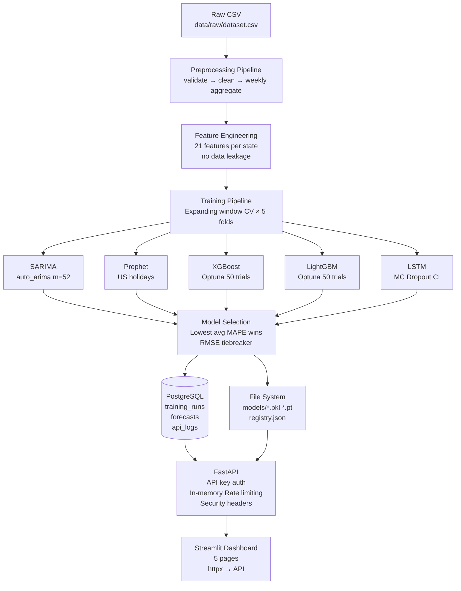

# 📈 Sales Forecasting System

> Production-ready time series forecasting with automatic model selection, REST API, Streamlit dashboard, and PostgreSQL.

---

## Architecture



---

## Tech Stack

| Layer | Technology | Version |
|---|---|---|
| API Framework | FastAPI + Uvicorn | 0.115 / 0.30 |
| Dashboard | Streamlit + Plotly | 1.38 / 5.24 |
| ORM | SQLAlchemy | 2.0 |
| Database | PostgreSQL | 16 |
| Rate limiting | In-Memory | — |
| Config | pydantic-settings | 2.5 |
| Logging | loguru | 0.7 |
| Validation | Pandera | 0.20 |
| SARIMA | pmdarima | 2.0 |
| Prophet | prophet (Meta) | 1.1 |
| Gradient Boosting | XGBoost + LightGBM | 2.1 / 4.5 |
| Neural Network | PyTorch | 2.4 |
| Hyperparameter Tuning | Optuna | 4.0 |
| Serialisation | joblib | 1.4 |
| CI/CD | GitHub Actions | — |
| Testing | pytest | 8.3 |
| Linting | ruff + black | 0.6 / 24.8 |

---

## Quick Start

### Prerequisites
- PostgreSQL running locally
- Python 3.11+ with conda (for local development)

### Local development (conda)

```bash
git clone https://github.com/BavirisettySairam/Sales-Forecasting.git
cd Sales-Forecasting

# Create and activate environment
conda create -n microgcc python=3.11 -y
conda activate microgcc

# Install dependencies
pip install poetry
poetry config virtualenvs.create false
poetry install

# Start PostgreSQL locally, then run database migrations
alembic upgrade head

# Train models
make train

# Start API (port 8000)
make serve

# Start dashboard (port 8501, in a second terminal)
make dashboard
```

---

## Train Models

```bash
# Train all 5 models on all states (full run, takes time)
make train

# Or via Python directly
python -m src.pipeline.train \
  --data data/raw/dataset.csv \
  --config config/training_config.yaml \
  --horizon 8 \
  --cv-splits 5

# Quick run (skip cross-validation, faster)
python -m src.pipeline.train \
  --data data/raw/dataset.csv \
  --skip-cv
```

---

## API Reference

All endpoints (except `/health`) require the header:
```
X-API-Key: forecasting-api-key-2026
```

### GET /health
No auth required. Returns status of API, database, and Redis.

```bash
curl http://localhost:8000/health
```

```json
{
  "status": "success",
  "data": {"api": "ok", "database": "ok", "redis": "ok"},
  "message": "healthy",
  "timestamp": "2026-04-29T16:00:00+00:00",
  "request_id": "550e8400-e29b-41d4-a716-446655440000"
}
```

### POST /forecast
Generate a sales forecast for a US state.

```bash
curl -X POST http://localhost:8000/forecast \
  -H "X-API-Key: forecasting-api-key-2026" \
  -H "Content-Type: application/json" \
  -d '{"state": "California", "weeks": 8}'
```

```json
{
  "status": "success",
  "data": {
    "state": "California",
    "model_used": "xgboost",
    "model_mape": 6.42,
    "forecast": [
      {"date": "2023-12-04", "predicted_value": 1245000.0, "lower_bound": 1100000.0, "upper_bound": 1390000.0},
      ...
    ]
  }
}
```

### GET /forecast/{state}
Convenience GET endpoint (defaults to 8 weeks).

```bash
curl http://localhost:8000/forecast/Texas \
  -H "X-API-Key: forecasting-api-key-2026"
```

### GET /models
List all trained models and their cross-validation metrics.

```bash
curl http://localhost:8000/models \
  -H "X-API-Key: forecasting-api-key-2026"
```

### GET /models/{state}
List models for a specific state.

```bash
curl http://localhost:8000/models/California \
  -H "X-API-Key: forecasting-api-key-2026"
```

### POST /retrain
Trigger background retraining. Invalidates Redis cache on completion.

```bash
# Retrain all states
curl -X POST http://localhost:8000/retrain \
  -H "X-API-Key: forecasting-api-key-2026" \
  -H "Content-Type: application/json" \
  -d '{}'

# Retrain a single state
curl -X POST http://localhost:8000/retrain \
  -H "X-API-Key: forecasting-api-key-2026" \
  -H "Content-Type: application/json" \
  -d '{"states": ["California"]}'
```

---

## Model Selection Methodology

### Dataset
- **8,085 rows** of weekly sales data across **43 US states**
- Date range: January 2019 – November 2023
- Mixed date formats handled: `M/D/YYYY` and `D-MM-YYYY`
- 68,757 date gaps filled via linear interpolation
- Resampled to **11,008 weekly rows** (W-MON anchor)

### Five Models
| Model | Algorithm | Confidence Intervals |
|---|---|---|
| SARIMA | auto_arima, seasonal m=52 | Analytical (ARIMA covariance) |
| Prophet | Additive decomposition + US holidays | Stan sampling (yhat_lower/upper) |
| XGBoost | Gradient boosting + Optuna (50 trials) | Quantile regression (q0.05, q0.95) |
| LightGBM | Gradient boosting + Optuna (50 trials) | Quantile regression (q0.05, q0.95) |
| LSTM | 2-layer PyTorch, MinMaxScaler | Monte Carlo Dropout (100 passes) |

### Cross-Validation
**Expanding window** — each fold trains on all data up to the split point and evaluates on the next `horizon` weeks. No future data is ever visible during training.

```
Fold 1: train[0:60]  → test[60:68]   (8 weeks)
Fold 2: train[0:68]  → test[68:76]
Fold 3: train[0:76]  → test[76:84]
...
```

### Champion Selection
1. Average MAPE across all CV folds (primary — scale-independent)
2. RMSE as tiebreaker (penalises large errors more than MAE)

The winning model is serialised to disk and registered as the champion. The `/forecast` endpoint always loads the champion.

### Feature Engineering (for tree-based models)
21 features per state, all computed from past data only:

| Group | Features |
|---|---|
| Lag | lag_1, lag_7, lag_14, lag_30 |
| Rolling mean | rolling_mean_7, rolling_mean_14, rolling_mean_30 |
| Rolling std | rolling_std_7, rolling_std_14, rolling_std_30 |
| Calendar | week_of_year, month, quarter, year, dayofweek, is_month_start, is_month_end |
| Holiday | is_holiday, days_to_next_holiday, days_from_last_holiday |
| Trend | linear_trend |

---

## Project Structure

```
Sales-Forecasting/
├── .github/workflows/ci.yml       # CI: lint → security scan + test → docker build
├── config/training_config.yaml    # All model hyperparameters (central config)
├── data/raw/                      # Raw dataset CSV (gitignored)
├── docker-compose.yml             # 4 services: api, streamlit, postgres, redis
├── Dockerfile                     # API service (non-root appuser)
├── Dockerfile.streamlit           # Dashboard service
├── Makefile                       # Developer targets
├── models/                        # Serialised artifacts + registry.json (gitignored)
├── secrets/                       # Docker secrets (gitignored)
│   ├── db_password.txt
│   ├── redis_password.txt
│   └── api_key.txt
├── src/
│   ├── api/                       # FastAPI application
│   │   ├── main.py                # App factory, lifespan, middleware registration
│   │   ├── auth.py                # X-API-Key header authentication
│   │   ├── middleware.py          # Request logging + security headers
│   │   ├── rate_limiter.py        # Redis sliding-window rate limiting
│   │   ├── exceptions.py          # Custom exception → HTTP handlers
│   │   ├── dependencies.py        # DB session + Redis FastAPI deps
│   │   ├── routes/                # health, forecast, models, retrain
│   │   └── schemas/               # request, response, error Pydantic models
│   ├── cache/redis_client.py      # Forecast cache + rate limit primitives
│   ├── config/settings.py         # pydantic-settings + Docker secret loader
│   ├── dashboard/                 # Streamlit 4-page app
│   │   ├── app.py                 # Landing page — summary cards
│   │   └── pages/
│   │       ├── 01_forecast.py     # Plotly chart + CI band + table
│   │       ├── 02_model_comparison.py  # MAPE bar chart + heatmap
│   │       ├── 03_training_history.py  # Training runs table + retrain trigger
│   │       └── 04_api_health.py   # Live health indicators + latency chart
│   ├── db/                        # SQLAlchemy ORM + session management
│   ├── features/engineering.py    # 21 features, zero leakage
│   ├── models/                    # 5 forecaster implementations + base class
│   ├── pipeline/                  # train, evaluate, select, registry
│   ├── preprocessing/             # validator, cleaner, pipeline
│   └── utils/                     # logger, response builder
└── tests/                         # 86 tests across 5 modules
    ├── conftest.py                # SQLite DB, mock Redis, sample data, test client
    ├── test_preprocessing.py      # 18 tests
    ├── test_features.py           # 16 tests (including leakage proofs)
    ├── test_models.py             # 14 tests (all 5 models, save/load roundtrip)
    ├── test_api.py                # 17 tests
    └── test_security.py           # 21 tests
```

---

## Design Decisions & Trade-offs

### Per-state models vs. global model
Each of the 43 states gets its own champion model. California's sales are 4× Wyoming's — a global model averages these differences and performs worse for all states. Per-state models find each state's optimal algorithm and hyperparameters independently.

### MAPE as primary metric
MAPE is scale-independent: 5% error on a $10M state equals 5% on a $100K state. RMSE is scale-sensitive and would bias the selection toward large-volume states.

### Redis caching
Forecast results are cached for 24 hours (`forecast:{state}:{weeks}`). Cache hit latency: <1ms. Cache miss latency: ~100–500ms (model load + inference). Most daytime requests are hits, making the API feel nearly instant.

### Synchronous SQLAlchemy
The API's database writes (storing forecast results, request logs) happen after the response is already generated. Full async SQLAlchemy (`asyncpg`) adds significant complexity with minimal throughput benefit, given Redis handles the hot path.

### Monte Carlo Dropout for LSTM uncertainty
Running 100 stochastic forward passes through a dropout-enabled LSTM approximates Bayesian inference without the cost of full variational inference. The 2.5th–97.5th percentile of predictions forms the 95% confidence interval.

---

## Running Tests

```bash
# Full suite
make test

# With coverage
pytest tests/ -v --tb=short

# Single module
pytest tests/test_security.py -v
```

---

## CI/CD Pipeline

GitHub Actions runs on every push to `main` and every pull request:

```
lint (ruff + black)
    ├── security-scan (pip-audit + safety)   ← parallel
    └── test (pytest + real Postgres + Redis) ← parallel
            └── docker-build + smoke test (curl /health)
```

---

## Future Upgradations

- **Caching & Rate Limiting (Redis):** Redis was originally used for cross-process caching and rate-limiting but was temporarily removed from the main branch due to unresolvable errors during development constraints. Reintegrating Redis would improve performance for high-traffic API loads.
- **Containerization (Docker):** Dockerization and `docker-compose` setups were tested but caused environmental issues and were rolled back for future deployment refinement. Providing a stable, robust Docker implementation is a top priority for scaling the infrastructure.

---

## Future Enhancements

- **MLflow** — experiment tracking and model versioning
- **Apache Airflow** — scheduled weekly retraining DAG
- **Kubernetes** — horizontal scaling for the API service
- **Prometheus + Grafana** — real-time latency and error rate monitoring
- **LLM query interface** — "What will California sales look like next month?"
- **A/B testing framework** — canary deploy new champion before full rollout
